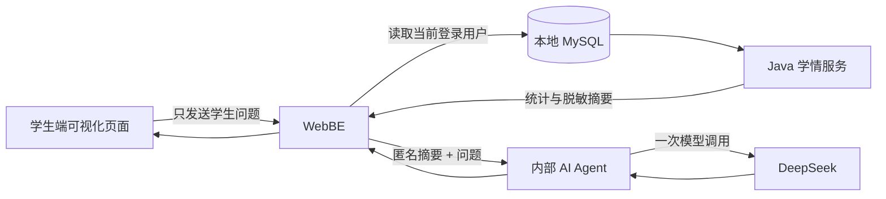

# 星云项目修改详细文档

> 文档版本：本地开发改造版
>
> 当前分支：`codex/agent-architecture-refactor`
>
> 回退存档：`agent架构存档` / `52e3503c5510b1a7c2e9c1542e32f4506b2df991`

## 1. 文档目的

本文档记录本轮对星云项目的完整修改内容，供本地验收、后续开发和 GitHub 协作使用。

本轮重点不是重新开发一套 AI，而是调整 AI 学习中心的职责边界：

1. 前三个可视化页面使用真实本地数据库数据。
2. WebBE 使用 Java 代码完成查询和统计。
3. AI 助教只接收脱敏后的统计摘要。
4. DeepSeek 只负责解释、总结和给出建议。
5. 智能组卷暂时保持禁用，后续单独改造。

## 2. 项目当前组成

当前仓库包含以下主要服务：

| 服务 | 目录 | 本地入口 | 作用 |
|---|---|---|---|
| 学生端前端 | `WebFE/wdd-user-web` | `http://127.0.0.1:6001` | 学生考试、学习中心、AI 助教 |
| 教学管理前端 | `WebFE/wdd-admin` | `http://127.0.0.1:6003` | 教师业务和系统管理 |
| 学生端后端 | `WebBE/wdd-user-web` | 由 Nginx 代理 | 学生数据、考试记录、AI 学习接口 |
| 管理端后端 | `WebBE/wdd-admin` | 由管理端前端代理 | 用户、权限、题库、考试管理 |
| AI Agent | `AI_AGENT/projects` | Docker 内部 8000 | 接收摘要并调用 DeepSeek |
| Nginx | `Nginx` / `nginx` | 6001、6003 | 统一代理和前端静态资源 |
| MySQL | Docker 服务 `mysql` | 127.0.0.1:3306 | 本地业务数据库 |
| Redis | Docker 服务 `redis` | 127.0.0.1:6379 | 登录会话和缓存 |

代码仓实际有两个独立前端：学生端和教学管理端。教师业务与系统管理目前共用教学管理前端，通过登录角色和菜单权限区分，不是三个完全独立的前端工程。

## 3. 修改前的问题

### 3.1 AI 助教与真实学情脱节

原来的 AI 助教主要是通用问答壳子。模型没有稳定接收到当前学生的成绩趋势、平均分和流程状态，因此无法可靠回答：

- 最近为什么不稳定
- 当前考情分析页面代表什么
- 下一阶段应该优先提升什么
- 如何根据真实正确率制定复习计划

### 3.2 前端统计重复且页面职责不清

前端曾经多次请求考试答卷分页接口，再由 Vue 端重复做统计，存在请求多、统计口径分散和空值误判的问题。

### 3.3 Agent 存在数据库工具外传风险

旧工具目录中保留了 Supabase、考试分析、学情查询和组卷工具。若继续由 Agent 调度这些工具，模型可能接触姓名、学号、完整答卷或数据库凭据。

### 3.4 页面缺少可视化入口

总览、考情分析、学情档案和 AI 助教之间缺少上下文跳转，学生看到图表后不能直接围绕图表提问。

## 4. 改造后的总体架构



核心原则是：

```text
数据查询和计算归 WebBE
自然语言解释归 Agent/DeepSeek
身份认证只在 WebBE
浏览器不直接向 Agent 提供学情数据
```

## 5. WebBE 修改详情

### 5.1 新增文件

- `WebBE/wdd-user-web/src/main/java/com/mindskip/wdd/controller/AiLearningController.java`
- `WebBE/wdd-user-web/src/main/java/com/mindskip/wdd/service/AiLearningService.java`
- `WebBE/wdd-user-web/src/main/java/com/mindskip/wdd/service/impl/AiLearningServiceImpl.java`
- `WebBE/wdd-user-web/src/main/java/com/mindskip/wdd/service/AiAssistantService.java`
- `WebBE/wdd-user-web/src/main/java/com/mindskip/wdd/service/impl/AiAssistantServiceImpl.java`
- `WebBE/wdd-user-web/src/main/java/com/mindskip/wdd/viewmodel/ai/AiLearningWorkspaceVM.java`

### 5.2 聚合接口

接口：

```http
POST /api/ai/learning/workspace
```

处理流程：

1. 从登录态获取当前 `User`。
2. 使用当前用户 ID 查询考试答卷记录。
3. 读取考试状态、分数和题目汇总。
4. Java 计算页面需要的指标。
5. 返回统一的 `AiLearningWorkspaceVM`。

前端不再按页面分别拉取答卷分页数据，也不再在 Vue 中重复计算主要指标。

### 5.3 统计指标

后端目前计算以下指标：

| 指标 | 含义 |
|---|---|
| `counts.total` | 当前学生的考试记录总数 |
| `counts.finalized` | 已定稿记录数 |
| `counts.validFinalized` | 可用于统计的有效定稿数 |
| `counts.invalidFinalized` | 核验失败或异常定稿数 |
| `counts.waitingReview` | 待批改数量 |
| `counts.waitingVerification` | 待核验数量 |
| `counts.verificationFailed` | 核验失败数量 |
| `summary.recentAveragePercent` | 最近最多六场的平均得分率 |
| `summary.changeFromFirstPercentPoints` | 最近样本首场到末场变化百分点 |
| `summary.volatilityPercentPoints` | 最近样本成绩波动幅度 |
| `summary.questionAccuracyPercent` | 有效定稿考试的题目汇总正确率 |
| `summary.accuracySampleCount` | 参与正确率计算的考试场次数 |
| `summary.finalizedPercent` | 定稿率 |
| `trend` | 最多六场的分数和题目汇总趋势 |

特别处理：

- 组卷方式字段 `paper_type` 不被错误当成正式考试标志。
- 缺失分数返回 `null`。
- 真实 0 分保留为 `0`。
- 正确率的统计范围和最近六场成绩范围分开计算。
- 没有知识点标签时返回“知识点数据不可用”，不虚构薄弱知识点。

## 6. AI 助教接口详情

### 6.1 学生提问

```http
POST /api/ai/learning/assistant
Content-Type: application/json
```

浏览器请求体只有：

```json
{
  "message": "根据正确率和平均分，给我制定一周复习计划"
}
```

WebBE 内部才会追加：

- 随机匿名会话 ID
- 当前用户对应的脱敏学情摘要

### 6.2 新对话

```http
POST /api/ai/learning/assistant/session/reset
```

会话 ID 存储在 WebBE 内存映射中，按当前用户隔离。浏览器不会接触这个 ID，也不能通过用户名猜测他人的会话。

### 6.3 Agent 内部接口

Agent 内部使用 `/api/v1/chat`，只允许由 WebBE 在 Docker 网络内调用。Nginx 对外只保留健康检查，不暴露聊天接口。

## 7. 模型数据白名单

发送给 DeepSeek 的数据限定为以下结构：

```json
{
  "source": "LOCAL_MYSQL",
  "counts": {},
  "summary": {},
  "trend": [],
  "knowledgePoints": {}
}
```

允许内容：

- 考试总数和状态数量
- 最近最多六场的数值得分趋势
- 平均得分率和成绩波动
- 题目正确率及其统计场次数
- 知识点数据是否可用

禁止内容：

- 姓名、工号、用户名、部门和身份资料
- Cookie、Token、API Key
- MySQL/Supabase 账号、密码、SQL
- 完整试卷、完整答卷、试卷名称
- 原始数据库对象和未脱敏记录

## 8. Agent 修改详情

主要文件：

- `AI_AGENT/projects/src/agents/agent.py`
- `AI_AGENT/projects/src/main.py`

### 8.1 工具权限

当前配置为：

```python
tools = []
```

因此 Agent 不再：

- 查询 Supabase
- 查询 MySQL
- 生成 SQL
- 调度旧考试分析工具
- 调度学情档案工具
- 调度智能组卷工具

旧工具文件仍保留为 legacy，当前未导入、未注册、不可达，便于后续回退和独立清理。

### 8.2 摘要校验

`main.py` 中的 `_sanitize_learning_context` 会检查：

- 数据来源必须为 `LOCAL_MYSQL`
- 数量不能为负数，且不能超过总数
- 各状态数量之和必须与总数一致
- 有效定稿数和异常定稿数必须与定稿数一致
- 百分比必须在合法范围内
- 趋势最多六条
- 答对题数不能超过题目数
- 摘要样本数必须与趋势长度一致

### 8.3 回答约束

Agent 被要求：

- 先给结论，再给数据依据和建议
- 区分事实、计算结果、假设和建议
- 不把未提供的难度、知识点、答题用时和心理状态写成事实
- 不比较平均得分率与题目正确率的高低
- 不把逐场题目数据擅自描述为正确率上升或下降
- 不把题量列为成绩变化原因
- 不要求学生上传完整试卷或完整答卷
- 待批改、待核验属于流程状态，不要求学生自行处理

## 9. 前端修改详情

主要文件：

- `WebFE/wdd-user-web/src/views/ai/workspace.vue`
- `WebFE/wdd-user-web/src/views/ai/tabs/AiAssistantTab.vue`
- `WebFE/wdd-user-web/src/views/ai/tabs/AiOverviewTab.vue`
- `WebFE/wdd-user-web/src/views/ai/tabs/ExamAnalysisTab.vue`
- `WebFE/wdd-user-web/src/views/ai/tabs/LearningProfileTab.vue`
- `WebFE/wdd-user-web/src/views/ai/components/ExamTrendChart.vue`
- `WebFE/wdd-user-web/src/views/ai/types.ts`
- `WebFE/wdd-user-web/src/api/aiLearning.ts`
- `WebFE/wdd-user-web/src/api/aiAgent.ts`

已完成的页面功能：

1. 总览页面展示真实考试数量、定稿率、平均分、正确率和波动。
2. 考情分析页面展示最近六场成绩趋势和状态分布。
3. 学情档案页面展示学习档案和数据洞察。
4. AI 助教页面支持连续问答。
5. 图表旁增加“询问 AI”。
6. 报告弹窗增加“让 AI 解读报告”。
7. 学情档案增加“让 AI 结合档案制定计划”。
8. “新对话”会清理前端消息并重置服务端会话。
9. 页面明确显示哪些数据会提供给 AI，哪些数据永远不会发送。
10. 移动端 390×844 验证无横向溢出。

## 10. Nginx 和 Docker 修改

### 10.1 Nginx

修改了以下两个配置文件，保持大小写目录兼容：

- `Nginx/nginx.conf`
- `nginx/nginx.conf`

浏览器可访问：

```text
/ai-agent/health
```

浏览器直接访问 Agent 聊天路径返回 404，聊天必须经过 WebBE 登录接口。

### 10.2 Compose

根目录 `docker-compose.yml` 以及 Agent 示例配置同步了：

- Agent 服务名和内部网络
- 模型配置项
- 本地环境变量说明
- Supabase 旧环境变量移除
- `.env` 使用方式

真实 API Key 不写入 Git 跟踪文件，只存在于本地忽略的环境配置中。

## 11. 本地运行方式

在 Docker Desktop 正常启动后，在项目根目录运行：

```powershell
cd D:\AI_Project\星云
docker compose -p xingyun up -d
docker compose -p xingyun ps
```

访问地址：

```text
学生端：http://127.0.0.1:6001
教学管理端：http://127.0.0.1:6003
```

如果 DeepSeek 显示网络不可用：

1. 检查本机代理是否能访问 `api.deepseek.com`。
2. 切换一个可访问 DeepSeek 的代理节点。
3. 点击页面中的“重新检测”。
4. 不要把 API Key 写进源码、Dockerfile、README 或提交记录。

## 12. 构建和验证记录

本轮已完成：

- WebBE Java 源码编译通过
- 学生端 `vue-tsc --noEmit && vite build` 通过
- Agent Python 语法检查通过
- Agent Docker 镜像构建通过
- backend、user、agent、nginx 容器重启并通过运行检查
- 学生端真实数据页面通过浏览器验收
- AI 助教真实调用曾成功返回解释和学习建议
- 连续对话通过验收
- 总览、考情分析、学情档案和 AI 助教四个 Tab 可切换
- 图表、报告、档案上下文提问入口可用
- 浏览器控制台 error/warn 数量为 0
- 1280px 和 390px 视口无横向溢出
- DeepSeek 样式密钥扫描命中数为 0
- `.env` 和 `AI_AGENT/projects/.env` 被 Git 忽略
- `git diff --check` 通过

DeepSeek 网络连接属于本机外部网络条件。网络失败时，系统返回明确错误，不会用假数据冒充模型回答。

## 13. Git 协作和回退

当前改造分支：

```text
codex/agent-architecture-refactor
```

回退存档分支：

```text
agent架构存档
```

回退提交：

```text
52e3503c5510b1a7c2e9c1542e32f4506b2df991
```

当前改造尚未提交，建议验收无误后再执行：

```powershell
cd D:\AI_Project\星云
git status
git add .
git commit -m "refactor: secure AI learning assistant context"
git push -u origin codex/agent-architecture-refactor
```

提交前必须确认：

- `git status` 中没有 `.env`
- 没有出现 `sk-` 样式密钥
- 没有把 Docker 本地构建链接当作项目链接提交
- 远程仓库使用 GitHub 仓库地址协作

## 14. 当前已知事项和后续计划

### 已知事项

1. 教师业务和管理业务目前共用 `wdd-admin` 前端，尚未拆成独立教师前端。
2. 智能组卷暂时禁用，避免在本轮 AI 助教改造中扩大范围。
3. DeepSeek 是否可调用取决于本机代理和外部网络。
4. 旧 Agent 工具文件仍保留，但当前运行路径不可达。
5. 当前改造还未提交 Git。

### 后续建议

1. 为教师建立独立角色菜单和权限集合。
2. 将 Agent 内存会话迁移到 Redis，并增加过期时间。
3. 为 WebBE 到 Agent 的内部请求增加服务间签名。
4. 增加 AI 助教请求限流、审计和错误重试。
5. 知识点标签数据接入后，再增加知识点级复习建议。
6. 单独设计和启用智能组卷流程。

## 15. 安全结论

当前最终形态是：

```text
WebBE 拥有数据库访问权
Agent 没有数据库访问权
DeepSeek 只收到匿名数值摘要
浏览器不把 Token 或 API Key 发给 Agent
Git 不跟踪本地密钥文件
```

这满足本地开发阶段“可解释、可回退、可协作、避免个人学习数据外传”的目标。
